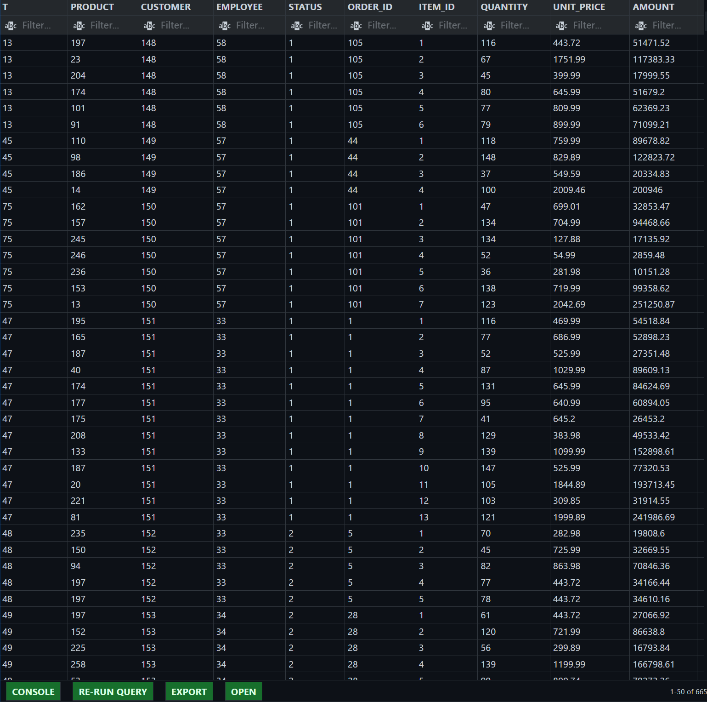
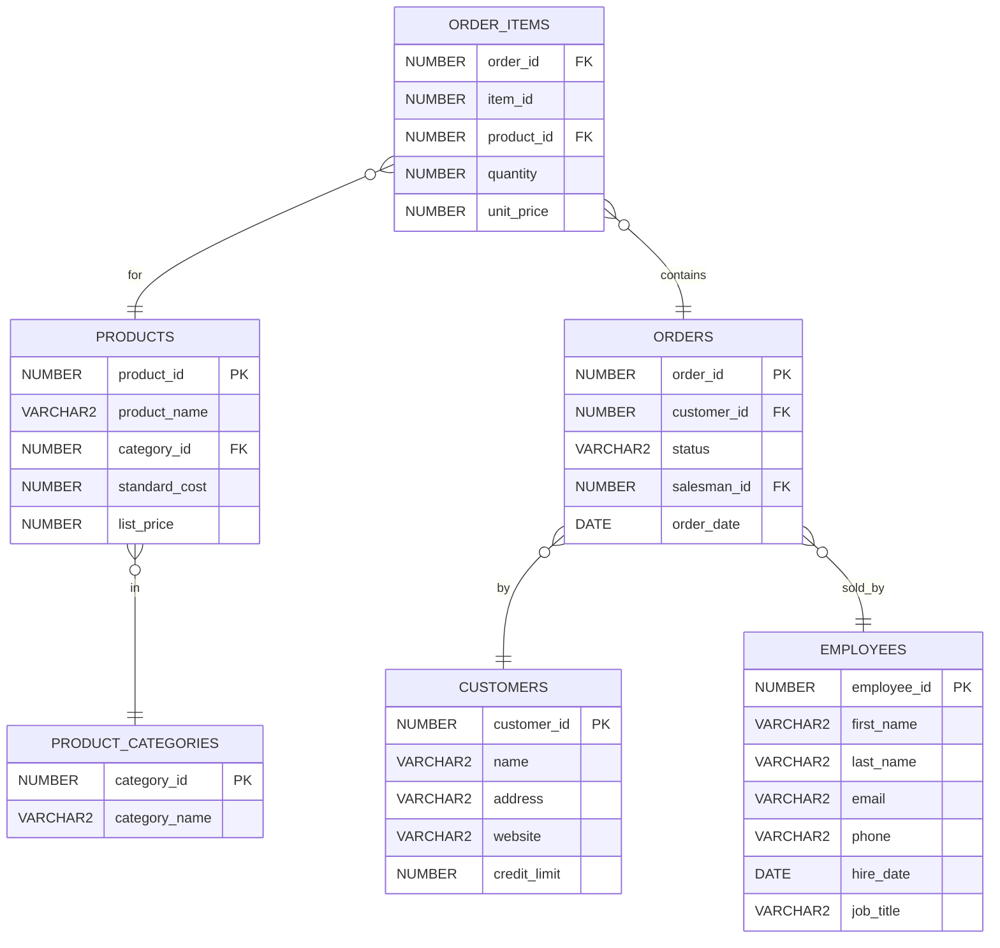
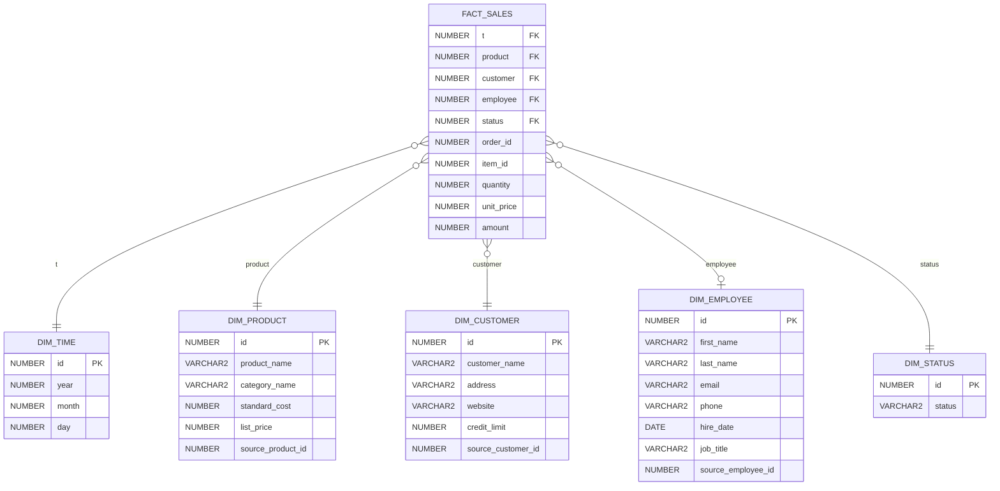

## Überblick

Diese Abgabe transformiert das OLTP-Schema der OT-Datenbank zu einem Star-Schema für den Analyse-Fokus "Sales" (Bestellungen und Positionen). Enthalten sind:

- DIMENSIONEN: `DIM_TIME`, `DIM_PRODUCT`, `DIM_CUSTOMER`, `DIM_EMPLOYEE`, `DIM_STATUS`
- FAKT: `FACT_SALES` (Grain: eine Zeile pro Bestellposition)
- DDL/DML-Skripte im Verzeichnis `sql/`
- Ausführungs-Skript `sql/assignment_run.sql`
- Visualisierungen (Mermaid-ER- und Star-Diagramme)

## Artefakte in diesem Repository

- `sql/01_dim_company_ddl.sql` – DDL für alle Dimensionen
- `sql/02_dim_company_load.sql` – Beladen der Dimensionen aus OLTP
- `sql/03_fact_sales_load.sql` – Erzeugen (falls fehlend) und Beladen der Faktentabelle
- `angabe/company_schema/ot_schema.sql` – OLTP-Ausgangsschema
- `angabe/company_schema/ot_data.sql` – Beispieldaten (OT)

## FACT_SALES

---

## OLTP – relevante Entitäten (Ausschnitt)

---

## Star-Schema – Zielmodell

Erläuterungen:

- Grain: eine Zeile pro Bestellposition (`order_id`, `item_id`).
- Measures: `quantity`, `unit_price`, `amount = quantity * unit_price`.
- Degenerierter Schlüssel: `order_id`, `item_id` liegen in der Faktentabelle für Lineage/Drill-Through.
- `employee` kann `NULL` sein (wenn `salesman_id` leer war);
  in Analysen kann optional ein "Unbekannt"-Mitglied ergänzt werden.

---

## Ausführungsreihenfolge

1. OLTP-OT-Schema bereitstellen (`angabe/company_schema/ot_schema.sql` + Daten)
2. Star-Schema erzeugen und befüllen:
   - `@sql/assignment_run.sql`

Die Skripte sind idempotent (löschen vor Neu-Ladung bzw. `CREATE IF MISSING`).

---

## Kurze technische Notizen

- Dimensionen nutzen Surrogat-Schlüssel via IDENTITY-Spalten (keine Sequenzen notwendig).
- `DIM_PRODUCT` denormalisiert die Kategorie.
- Zeitdimension wird aus `orders.order_date` generiert.
- Faktbeladung löst alle Schlüssel deterministisch über `SOURCE_*_ID` bzw. Status-Text und Datum auf.
