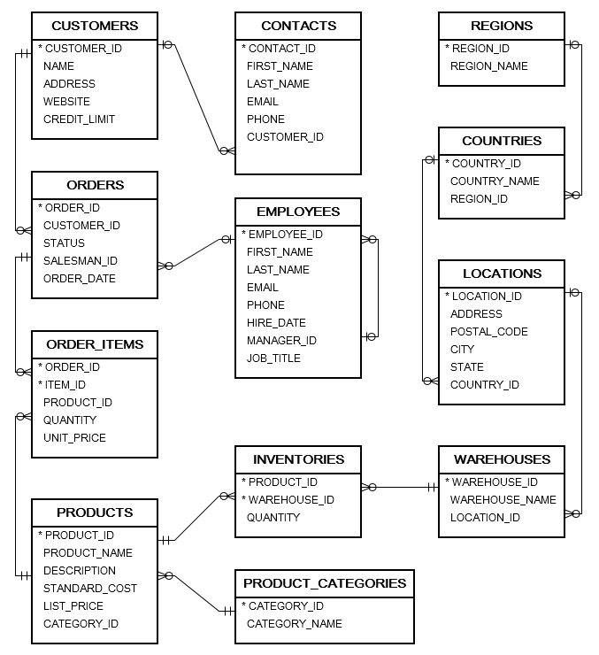

# Star-Schema Firmendatenbank

- Geöffnet: Mittwoch, 24. September 2025, 00:00
- Fällig: Dienstag, 7. Oktober 2025, 12:00

## Task

Überführen Sie das gegebene OLTP-Schema in ein Star-Schema:

- Identifizieren Sie Fact(s), Measures und Dimensionen
- DDL für die Abbildung dieser als ROLAP Model (Fact und Dimensionstabellen)
- DML-Statements zur Überfürung der OLTP-Daten in das ROLAP-Modell

## Diagram

## Files

- company_schema.zip

---

### Related

- [ORACLE-DOC](../quellen/moodle_externe_quellen.md)

---

#### Moodle Link

[Angabe/Abgabe](https://edufs.edu.htl-leonding.ac.at/moodle/mod/assign/view.php?id=214385)
